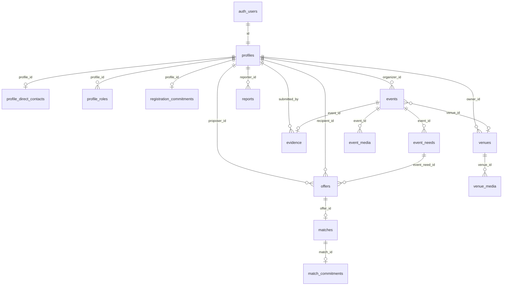

# Base de datos — Redeventos

Esquema PostgreSQL del piloto, definido en [`supabase/migrations/`](../../supabase/migrations/) (`0001`–`0007`). Auth en `auth.users` (Supabase). Tipos generados: [`shared/types/database.types.ts`](../../shared/types/database.types.ts).

Para reglas de producto: [`product/idea.md`](../product/idea.md). Para stack: [`architecture/stack.md`](./stack.md).

---

## Decisiones de imágenes (producto)

Respuestas acordadas e implementadas en `0007`:

| Ámbito | Decisión |
| --- | --- |
| **Perfiles** | Foto de perfil para identificar a la persona detrás del evento, espacio o emprendimiento local (ficha pública de aliado / contexto del organizador). |
| **Espacios** | Portada + galería en ficha pública y edición en `/app/venue`. |
| **Eventos (ficha pública)** | No subir portada aparte: **reutilizar** las fotos de evidencia (`event_media` / bucket `evidence`) una vez aprobada la evidencia (y en casos `/cases`). |
| **Evidencia** | Ampliar flujo actual: varias fotos al enviar evidencia; mostrar selección en casos públicos tras aprobación. |
| **Visibilidad Storage** | Buckets `profiles`, `venues` y `evidence` con `public = true`. La URL `/object/public/` **no aplica RLS de descarga**. La barrera pre-aprobación de evidencia es **no filtrar** `event_media.storage_path` (paths `{event_id}/{uuid}`). `list` de `evidence` sigue autenticado. |

---

## Diagrama de relaciones (resumen)

- **Editable (draw.io):** [`redeventos-database-er.drawio`](../diagrams/redeventos-database-er.drawio) — hoja *Esquema public* y hoja *Storage*.

---

## Tipos enumerados (`public`)

| Tipo | Valores |
| --- | --- |
| `city` | `pereira`, `dosquebradas` |
| `app_role` | `organizer`, `venue_sponsor`, `local_sponsor`, `moderator` |
| `need_type` | `venue`, `products`, `food`, `equipment`, `services`, `diffusion` |
| `event_category` | `tecnologia`, `literatura`, `cine`, `musica`, `educacion`, `emprendimiento`, `cultura`, `comunidades`, `networking` |
| `event_status` | `draft`, `published`, `public`, `completed`, `cancelled` |
| `need_status` | `open`, `partial`, `covered`, `cancelled` |
| `venue_support_mode` | `free`, `depends`, `rental_only` |
| `offer_status` | `pending`, `accepted`, `rejected`, `cancelled` |
| `match_status` | `accepted`, `completed`, `breached`, `cancelled` |
| `evidence_status` | `submitted`, `approved`, `rejected` |

---

## Tablas

### `profiles`

Persona en la red. `id` = `auth.users.id`. Slug único para URLs `/sponsors/{slug}`.

| Columna | Tipo | Notas |
| --- | --- | --- |
| `id` | `uuid` PK → `auth.users` | |
| `display_name` | `text` | 2–80 |
| `slug` | `text` unique | |
| `email` | `text` | |
| `instagram` | `text` nullable | Público |
| `website` | `text` nullable | Público, `https?://` |
| `city` | `city` nullable | |
| `contribution_types` | `need_type[]` | Default `{}` |
| `contribution_description` | `text` nullable | |
| `avatar_storage_path` | `text` nullable | Path en bucket `profiles` |
| `disaffiliated_at` | `timestamptz` nullable | Solo moderador |
| `hidden_at` | `timestamptz` nullable | Solo moderador |
| `created_at`, `updated_at` | `timestamptz` | |

Trigger: `handle_new_user()` crea fila + `profile_direct_contacts` al registrarse.

---

### `profile_direct_contacts`

WhatsApp y teléfono; RLS oculta a terceros hasta match aceptado (política ampliada en `0004`).

| Columna | Tipo |
| --- | --- |
| `profile_id` | `uuid` PK → `profiles` |
| `whatsapp`, `phone` | `text` nullable |
| `updated_at` | `timestamptz` |

---

### `profile_roles`

| Columna | Tipo |
| --- | --- |
| `profile_id` | `uuid` → `profiles` |
| `role` | `app_role` |
| `created_at` | `timestamptz` |

PK (`profile_id`, `role`). El registro público solo puede insertar roles distintos de `moderator`.

---

### `registration_commitments`

Aceptación de privacidad y compromiso de registro.

| Columna | Tipo |
| --- | --- |
| `profile_id` | `uuid` PK → `profiles` |
| `privacy_version`, `commitment_version` | `text` |
| `accepted_at` | `timestamptz` |

---

### `events`

| Columna | Tipo | Notas |
| --- | --- | --- |
| `id` | `uuid` PK | |
| `organizer_id` | `uuid` → `profiles` | |
| `title`, `slug` | `text` | Slug único |
| `category` | `event_category` | |
| `city` | `city` | |
| `starts_on` | `date` nullable | |
| `date_range_label` | `text` nullable | Si no hay `starts_on` |
| `expected_attendees` | `integer` | |
| `description`, `audience`, `sponsor_benefit` | `text` | |
| `rsvp_url` | `text` | Inscripción externa |
| `place_name` | `text` nullable | Requerido lógico en `public` |
| `venue_id` | `uuid` nullable → `venues` | |
| `status` | `event_status` | |
| (sin portada propia) | — | Visual de evento `completed` = `event_media` pública / `/cases` |
| `hidden_at` | `timestamptz` nullable | |
| `created_at`, `updated_at` | `timestamptz` | |

Constraint: `starts_on` o `date_range_label` obligatorio.

---

### `event_needs`

| Columna | Tipo |
| --- | --- |
| `id` | `uuid` PK |
| `event_id` | `uuid` → `events` |
| `type` | `need_type` |
| `description` | `text` |
| `quantity_requested`, `quantity_covered` | `numeric(12,2)`; `quantity_requested` nullable si no hay cantidad |
| `unit` | `text` nullable; solo si hay cantidad |
| `status` | `need_status` |
| `created_at`, `updated_at` | `timestamptz` |

---

### `venues`

| Columna | Tipo | Notas |
| --- | --- | --- |
| `id` | `uuid` PK | |
| `owner_id` | `uuid` → `profiles` | `venue_sponsor` |
| `name`, `slug` | `text` | |
| `city`, `zone` | | |
| `capacity` | `integer` | |
| `equipment`, `description` | `text` | |
| `support_mode` | `venue_support_mode` | |
| `cover_storage_path` | `text` nullable | Portada en bucket `venues` |
| `created_at`, `updated_at` | `timestamptz` | |

---

### `venue_media`

Galería del espacio. Lectura pública si el owner no está oculto ni desafiliado.

| Columna | Tipo |
| --- | --- |
| `id` | `uuid` PK |
| `venue_id` | `uuid` → `venues` |
| `storage_path` | `text` unique |
| `sort_order` | `smallint` |
| `created_at` | `timestamptz` |

---

### `offers`

Propuesta sobre una necesidad.

| Columna | Tipo |
| --- | --- |
| `id` | `uuid` PK |
| `event_need_id`, `event_id` | `uuid` |
| `proposer_id`, `recipient_id` | `uuid` → `profiles` |
| `venue_id` | `uuid` nullable → `venues` |
| `quantity` | `numeric` |
| `offer_on` | `date` |
| `note` | `text` |
| `status` | `offer_status` |
| `created_at`, `updated_at` | `timestamptz` |

RPC: `accept_offer`, `reject_offer`, `cancel_offer`.

---

### `matches`

Propuesta aceptada (una por offer).

| Columna | Tipo |
| --- | --- |
| `id` | `uuid` PK |
| `offer_id` | `uuid` unique → `offers` |
| `event_need_id`, `event_id` | `uuid` |
| `organizer_id`, `sponsor_id` | `uuid` → `profiles` |
| `status` | `match_status` |
| `created_at` | `timestamptz` |

---

### `match_commitments`

Compromiso concreto del match (qué, cuánto, cuándo).

| Columna | Tipo |
| --- | --- |
| `id` | `uuid` PK |
| `match_id` | `uuid` unique → `matches` |
| `what` | `text` |
| `quantity` | `numeric` |
| `when_on` | `date` |
| `accepted_at` | `timestamptz` |

---

### `evidence`

Una fila por evento (`event_id` unique). Organizador envía; moderador aprueba o rechaza.

| Columna | Tipo |
| --- | --- |
| `id` | `uuid` PK |
| `event_id` | `uuid` unique → `events` |
| `submitted_by` | `uuid` → `profiles` |
| `attendance_count` | `integer` |
| `venue_note`, `contributions_note` | `text` |
| `status` | `evidence_status` |
| `review_note` | `text` nullable |
| `reviewed_by` | `uuid` nullable → `profiles` |
| `created_at`, `updated_at` | `timestamptz` |

RPC: `review_evidence(p_evidence_id, p_decision, p_note)`.

---

### `event_media`

Referencias a objetos en Storage (hoy: fotos de evidencia por evento).

| Columna | Tipo | Notas |
| --- | --- | --- |
| `id` | `uuid` PK | |
| `event_id` | `uuid` → `events` | |
| `storage_path` | `text` unique | Ruta en bucket `evidence` |
| `kind` | `text` | `evidence` o `case_highlight` |
| `is_public` | `boolean` | `true` al aprobar evidencia |
| `created_at` | `timestamptz` | |

---

### `reports`

| Columna | Tipo |
| --- | --- |
| `id` | `uuid` PK |
| `reporter_id` | `uuid` → `profiles` |
| `target_type` | `text` | `event` \| `profile` |
| `target_id` | `uuid` |
| `reason` | `text` |
| `created_at`, `resolved_at` | `timestamptz` |

RPC moderador: `hide_target`, `disaffiliate_profile`.

---

## Vistas

| Vista | Propósito |
| --- | --- |
| `public_cases` | Eventos `completed` + evidencia `approved` → `/cases` (texto + `cover_path` de la primera media pública) |
| `public_case_covers` | Una fila por evento (`DISTINCT ON event_id`) con el primer `storage_path` público |
| `public_case_media` | Galería pública de un caso |
| `venue_calendar_days` | Días `negotiating` / `committed` por `venue_id` (desde `offers` + `matches`) |

---

## Funciones SQL (selección)

| Función | Uso |
| --- | --- |
| `is_moderator()` | RLS y triggers |
| `slugify(text)` | Slugs |
| `sponsor_completed_count(uuid)` | Sello / eventos completados |
| `accept_offer` / `reject_offer` / `cancel_offer` | Circuito de propuestas |
| `review_evidence` | Moderación |
| `hide_target` / `disaffiliate_profile` | Moderación |

---

## Storage (Supabase)

Gotcha: con `public = true`, `/storage/v1/object/public/{bucket}/{path}` no consulta RLS. Quien conozca el path puede descargar el objeto. `list` / `insert` / `update` / `delete` sí pasan por RLS.

| Bucket | Público | Límite | MIME | Path |
| --- | --- | --- | --- | --- |
| `profiles` | sí | 5 MB | jpeg, png, webp, avif | `{profile_id}/avatar.{ext}` |
| `venues` | sí | 5 MB | jpeg, png, webp, avif | `{venue_id}/cover.{ext}`, `{venue_id}/gallery/{uuid}.{ext}` |
| `evidence` | sí (desde `0007`) | 5 MB | jpeg, png, webp, avif | `{event_id}/{uuid}` |

El Worker Nitro no sirve bytes de imagen: el HTML solo incluye paths; el `` apunta a Storage.

### Checklist manual RLS (no hay tests unitarios de policies)

1. Anon no lista objetos de `evidence` ni lee `event_media` con `is_public = false`.
2. Tras `review_evidence(..., approved)`, `/cases/{slug}` muestra las fotos (HTTP 200 en URL pública).
3. Dueño de perfil/venue puede replace (INSERT+SELECT+UPDATE) y borrar su objeto.
4. Venue de owner `hidden_at` / `disaffiliated_at` no expone `venue_media` a anon.
5. Evento `hidden_at` no aparece en `public_cases` ni en media pública.

---

## Migraciones aplicadas

| Archivo | Contenido |
| --- | --- |
| `0001_profiles_and_commitments.sql` | Perfiles, roles, compromiso, RLS base |
| `0002_events_and_needs.sql` | Eventos y necesidades |
| `0003_venues.sql` | Espacios, FK `events.venue_id`, `sponsor_completed_count` |
| `0004_offers_and_matches.sql` | Propuestas, matches, compromisos, calendario, contactos post-match |
| `0005_evidence.sql` | Evidencia, `event_media`, reportes, `public_cases`, bucket `evidence` |
| `0006_evidence_storage_replace.sql` | Update/delete storage y `event_media` |
| `0007_media_profiles_venues.sql` | Avatar, portada/galería, `kind`/`is_public`, buckets públicos, vistas de casos |

Población local (no remoto): [`supabase/seed.sql`](../../supabase/seed.sql) vía `bun run db:seed:local`.

---

## Fuera del esquema actual (referencia)

No están en migraciones del piloto: `organizations`, `bookings`, `messages`, `event_attendees`, `venue_availability`. Chat, pagos y RSVP propio siguen fuera de [`idea.md`](../product/idea.md).
